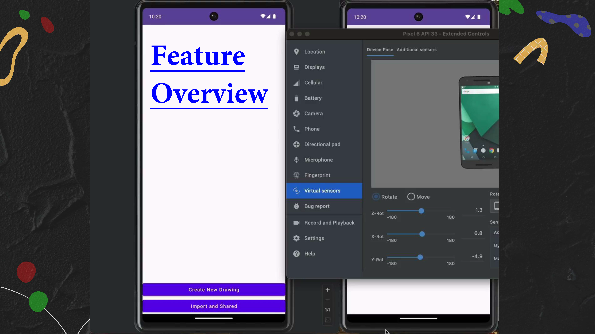
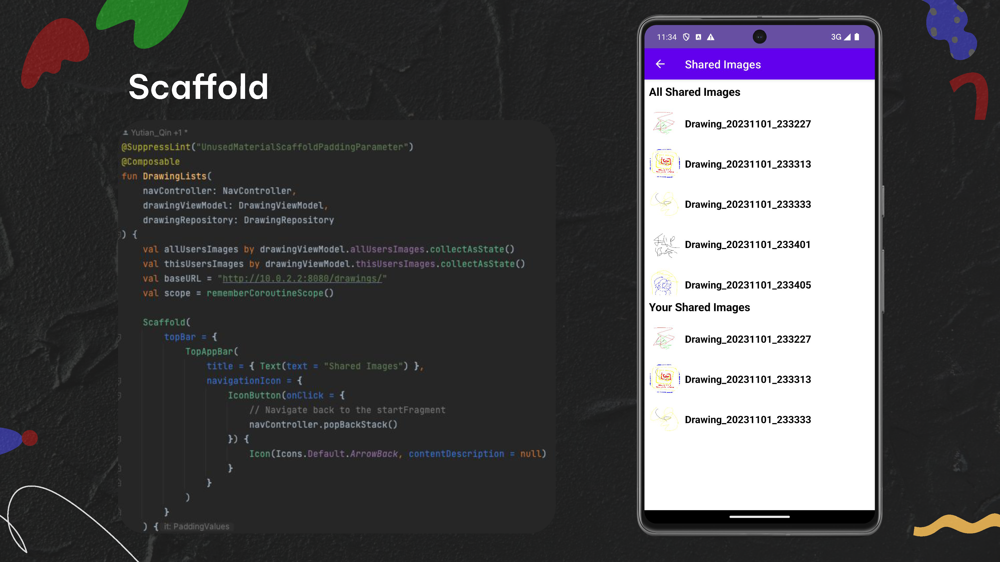
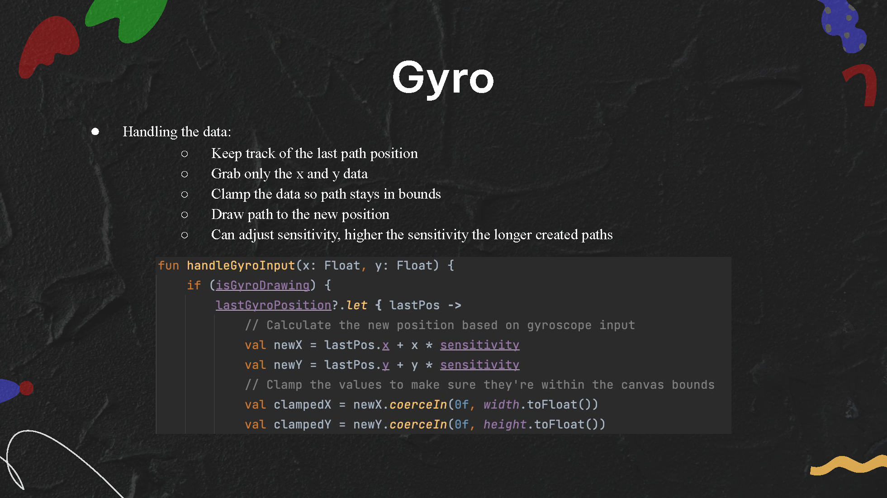
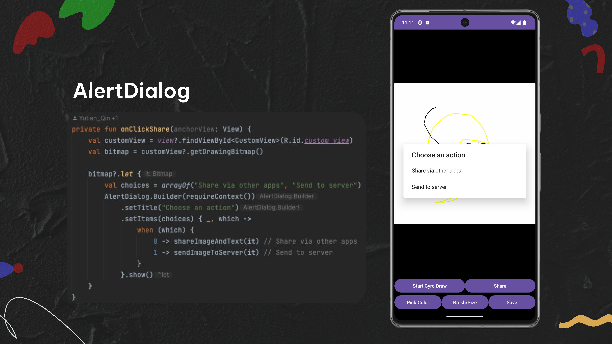
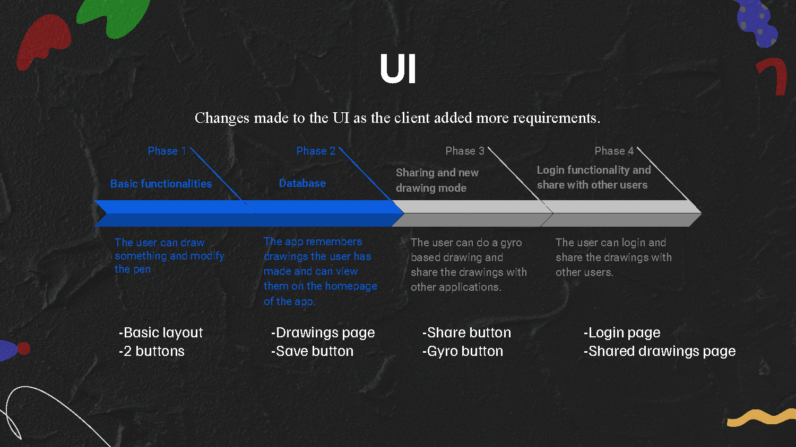

# android-sketcher_ktor
Android-based drawing app integrated with a Ktor backend server. It allows users to perform basic drawing functions, save their creations, and retrieve them later.

 

## Demo
<video src="resource/vid/demo.mov" controls width="100%"></video>
<video src="resource/vid/Demoo.webm" controls width="100%"></video>

 

## Feature

